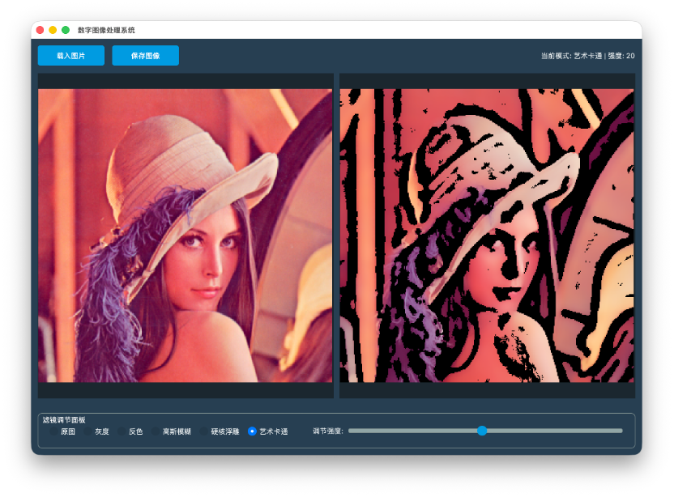

# Image Filter (Qt) | 图像滤镜 (Qt)

EN: A Qt + OpenCV desktop app that previews common image filters side-by-side and lets you tune intensity with a slider.

ZH: 一个基于 Qt + OpenCV 的桌面图像处理应用，支持并排预览常见滤镜并通过滑块调节强度。

## Screenshot | 示例


## Features | 功能
- Original, grayscale, invert, Gaussian blur, emboss, and cartoon filters | 原图、灰度、反色、高斯模糊、浮雕、卡通滤镜
- Live preview with source/processed panels | 原图/处理后双面板实时预览
- Adjustable filter intensity | 可调节滤镜强度
- Load/save images (JPG/PNG/BMP) | 支持加载/保存 JPG/PNG/BMP

## Tech Stack | 技术栈
- Qt Widgets (qmake) | Qt Widgets（qmake）
- OpenCV
- C++17

## Build | 构建
### Prerequisites | 依赖
- Qt 6 (or Qt 5 with Widgets) | Qt 6（或 Qt 5 Widgets）
- OpenCV 4

### Qt Creator
1. Open `image-filter.pro` in Qt Creator. | 在 Qt Creator 中打开 `image-filter.pro`。
2. Configure your kit (Qt + compiler). | 配置 Kit（Qt + 编译器）。
3. Build and run. | 编译并运行。

### qmake (CLI)
```bash
qmake image-filter.pro
make
```

## Project Structure | 项目结构
```
include/        # headers | 头文件
src/            # sources | 源码
ui/             # Qt Designer files | 设计器文件
```

## Notes | 备注
- On Windows, update the OpenCV paths in `image-filter.pro` to match your local installation. | Windows 下请按本机安装路径修改 `image-filter.pro` 中的 OpenCV 路径。

## License | 许可
MIT License. See LICENSE.
